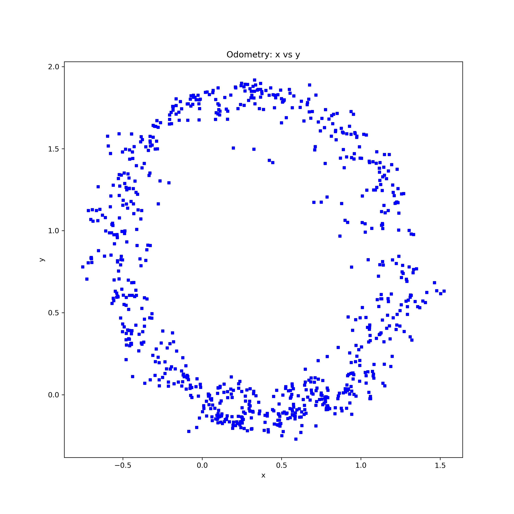
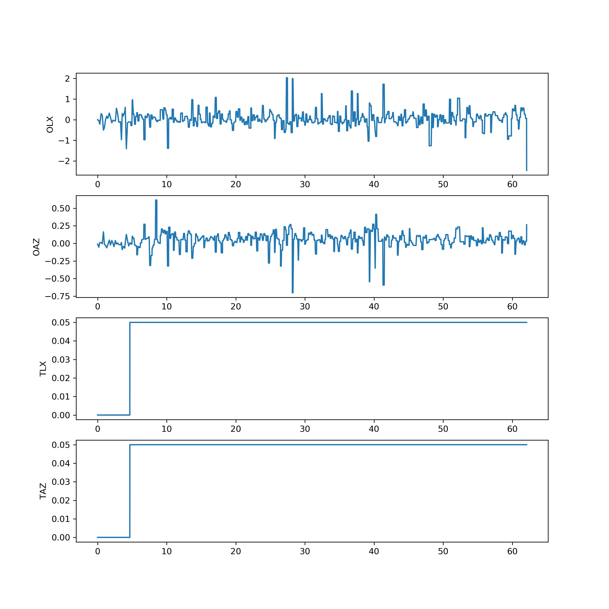

# LiDAR Odometry Testing

## Statistics

* Duration 60 seconds
* Command: 
```
rostopic pub -r 10 /cmd_vel geometry_msgs/Twist "linear:
  x: 0.05
  y: 0.0
  z: 0.0
angular:
  x: 0.0
  y: 0.0
  z: 0.05
```

* Results:

```
odom_linear_x:  min = -2.46      max = 2.04       avg = 0.05      
odom_angular_z: min = -0.70      max = 0.62       avg = 0.05      
twist_linear_x: min = 0.00       max = 0.05       avg = 0.05      
twist_angular_z:min = 0.00       max = 0.05       avg = 0.05 
```

## Figures




