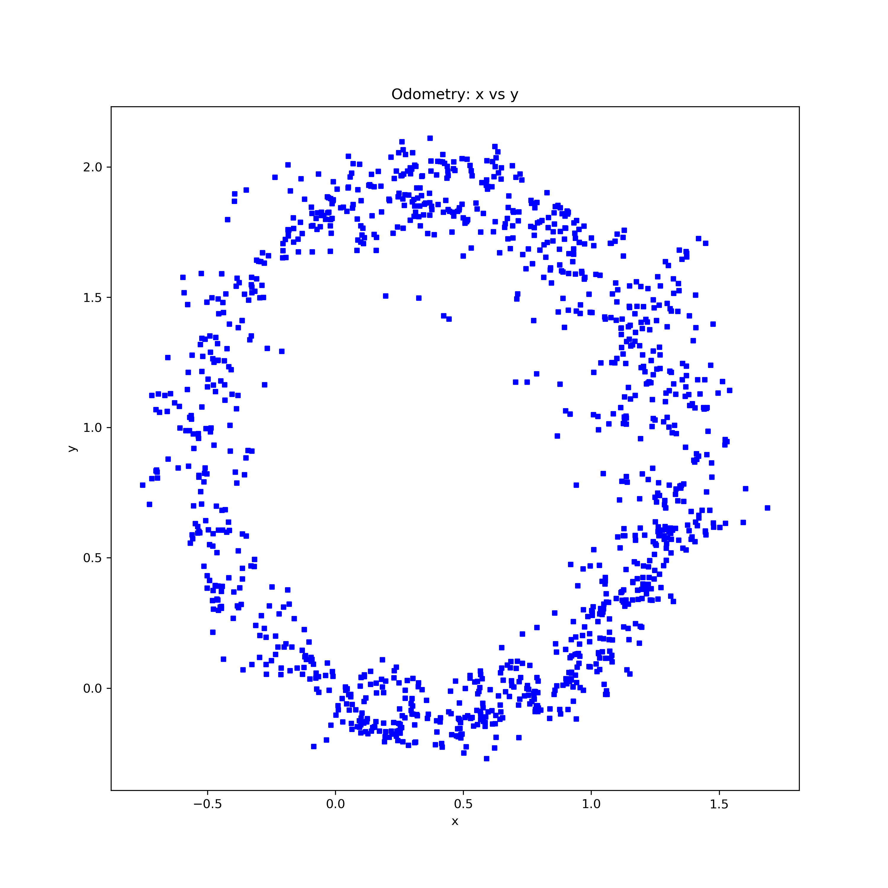
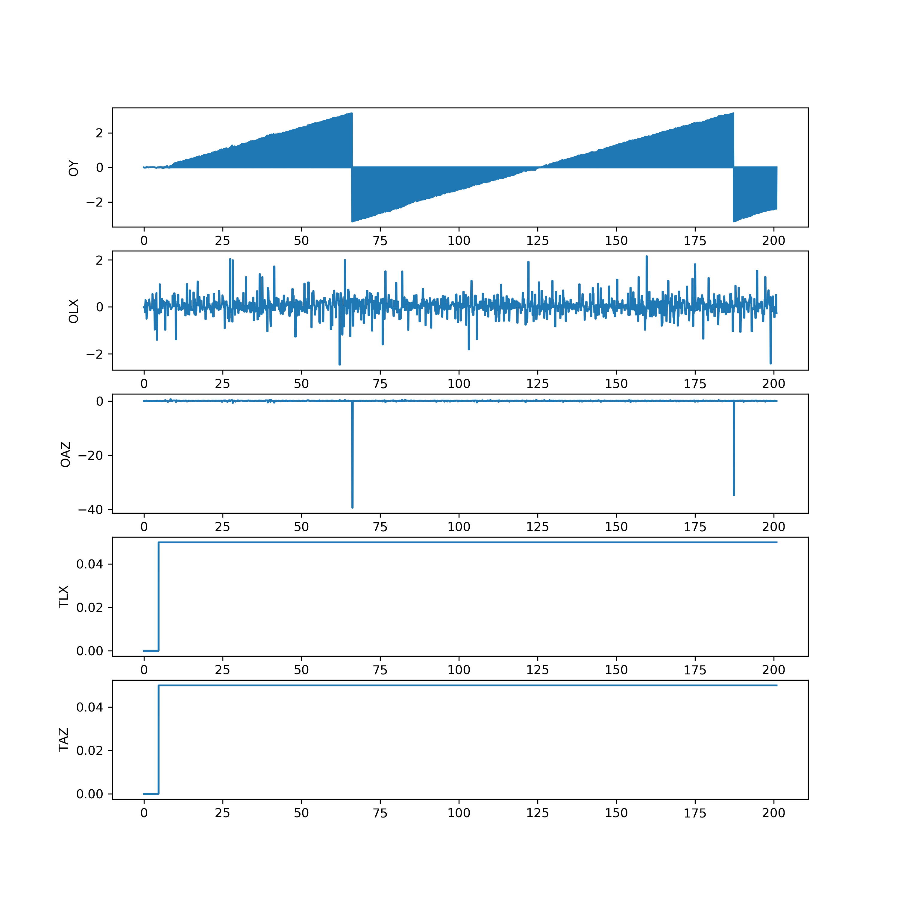

# LiDAR Odometry Testing

## Statistics

* Duration 60 seconds
* Command: 
```
rostopic pub -r 10 /cmd_vel geometry_msgs/Twist "linear:
  x: 0.05
  y: 0.0
  z: 0.0
angular:
  x: 0.0
  y: 0.0
  z: 0.05
```

* Results:

```
odom_yaw:       min = -3.14      max = 3.14       avg = 0.12      
odom_linear_x:  min = -2.46      max = 2.16       avg = 0.05      
odom_angular_z: min = -39.34     max = 0.62       avg = -0.01     
twist_linear_x: min = 0.00       max = 0.05       avg = 0.05      
twist_angular_z:min = 0.00       max = 0.05       avg = 0.05
```

## Figures




